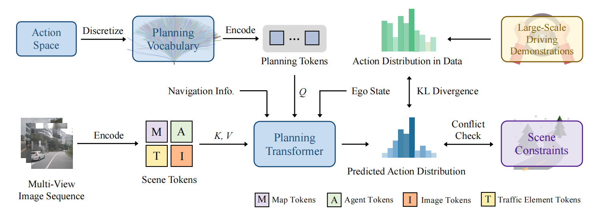
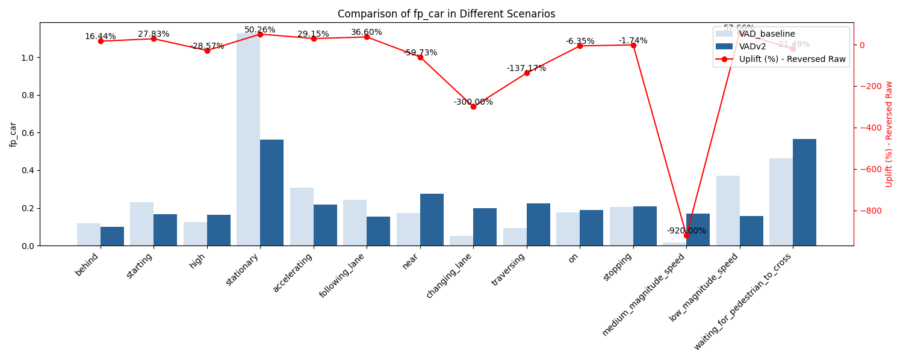
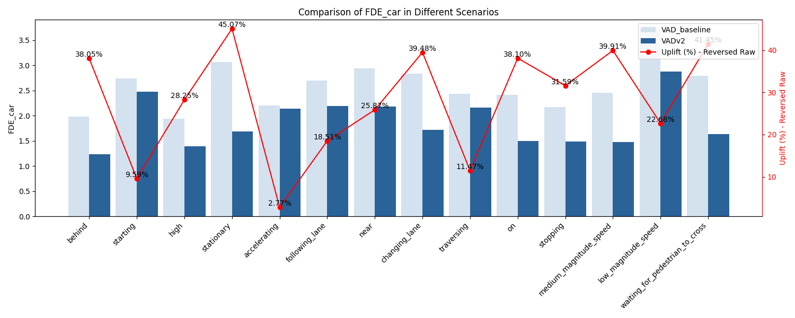
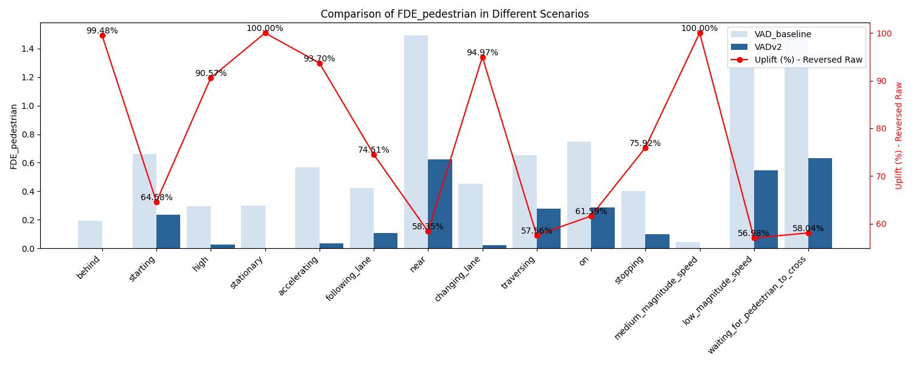
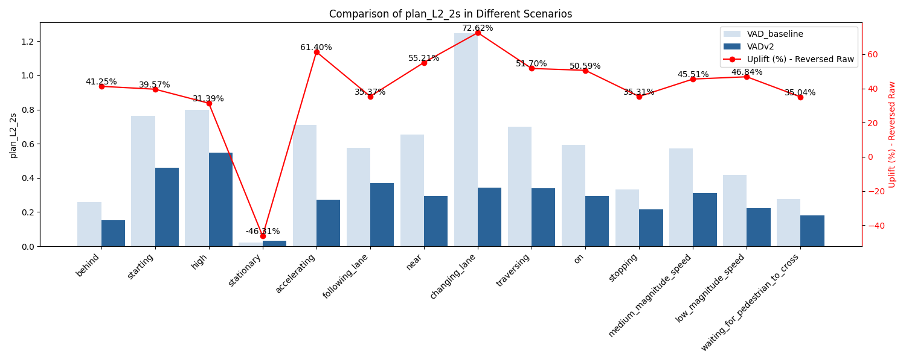
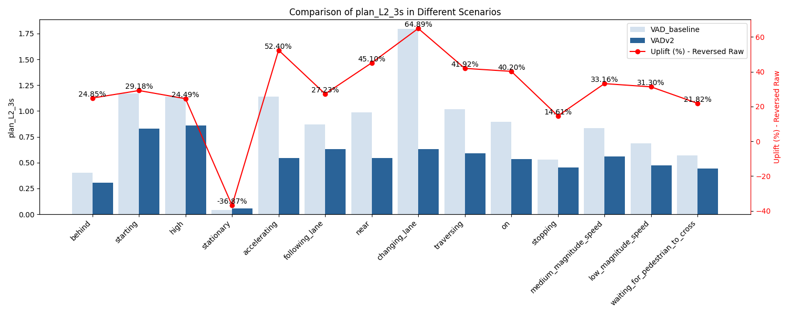
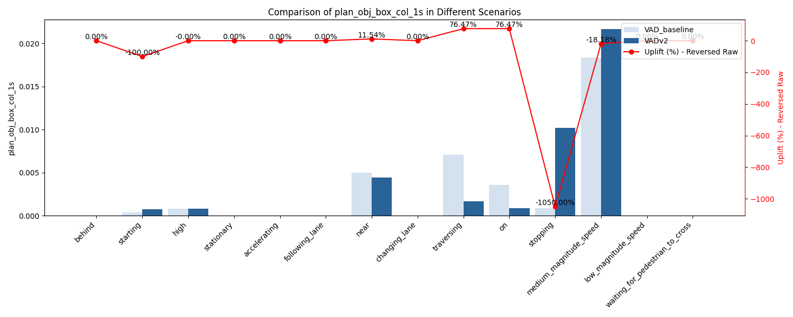
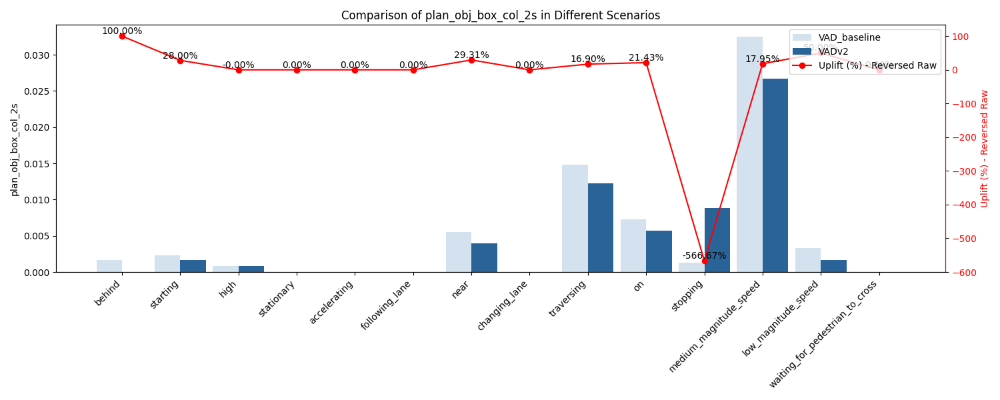
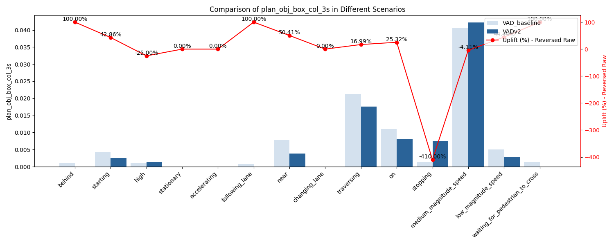

# VADv2

<p align="center">
    <video width="600" autoplay loop muted playsinline>
    <source src="docs/asset/VADv2.mp4" type="video/mp4">
    Your browser does not support the video tag.
    </video>
</p>
<p align="center">
    Demo
</p>


<p align="center">
    
</p>
<p align="center">
    Model Framework
</p>


## [Env Setup](docs/env_install.md)

## Train & Test

### Data Preparation

The same as VAD data format. 

### Trajectory Clustering

Refer to `tools/traj_clustering.py`, which will cluster all trajectories to 4096 classes. The following component will be saved:

- Cluster centroids: saved in `npy` format
- MiniBatchKMeans sklearn model: saved in `pkl` format
- Visualization as follows: 

<p align="center">

</p>

### Train script

Assume run on 2-GPUs machine. RTX4090 or higher is recommended.

```bash
torchrun --nproc_per_node=2 \
    --master_port=28510 \
    adzoo/vad/train.py \
    adzoo/vad/configs/VAD/VADv2_voca4096_config.py \
    --launcher=pytorch \
    --deterministic
```

### Test script

```bash
torchrun --nproc_per_node=1 --master_port=28512 \
    ./adzoo/vad/test.py \
    ./adzoo/vad/configs/VAD/VADv2_voca4096_config.py \
    path-2-your-model \
    --launcher=pytorch \
    --eval=bbox
```


## Open-loop Eval

Nuplan offers ruled-based tags for each driving scenario. We perform the test in various aspects and store each with multiple metircs. For the detail, check [`test/scenario_test`](test/scenario_test). 

We include comparison results between ``VADv2`` and ``VAD`` in this repo.

### Visualization

#### Perception

<details>
<summary>False Positive Cars (Click to see details)</summary>

</details>

<details>
<summary>False Positive Pedestrian (Click to see details)</summary>

</details>

<details>
<summary>ADE Car (Click to see details)</summary>

</details>

<details>
<summary>ADE Pedestrian (Click to see details)</summary>

</details>

<details>
<summary>FDE Car (Click to see details)</summary>

</details>

<details>
<summary>FDE Pedestrian (Click to see details)</summary>

</details>


#### Planning

<details>
<summary>Planner 1S L2 displacement (Click to see details)</summary>

</details>


<details>
<summary>Planner 2S L2 displacement (Click to see details)</summary>

</details>

<details>
<summary>Planner 3S L2 displacement (Click to see details)</summary>

</details>

<details>
<summary>Planner 1S Object Box Collision (Click to see details)</summary>

</details>


<details>
<summary>Planner 2S Object Box Collision (Click to see details)</summary>

</details>

<details>
<summary>Planner 3S Object Box Collision (Click to see details)</summary>

</details>

## Tools


### [Convert Nuplan Map to Json Tools](tools/convert_gt_map_json.py)

To correctly obtain map evaluation results, you first need to extract the ground truth map information from the test set. You can use the following command:

```bash
python tools/convert_gt_map_json.py \
    --data_root Path/to/nuplan \
    --pkl_path Path/to/nuplan/test/pkl \
    --save_path eval_map.json
```

Where:
- `--data_root`: Path to your nuplan dataset root directory
- `--pkl_path`: Path to the test set PKL files
- `--save_path`: Output path for the converted JSON file containing ground truth map information

#### sample data

The test sample data could be found at [``data/sample_data/sample_ann.pkl``](data/sample_data/sample_ann.pkl). A mini-mini-mini Dataset of Nuplan could be found at [``data/sample_data/nuplan``](data/sample_data/nuplan). Which includes the camera data and map data.

Run scripts

```bash
python lwad/convert_gt_map_json.py \            
    --data_root data/sample_data/nuplan/dataset \
    --pkl_path data/sample_data/sample_ann.pkl \
    --save_path data/sample_data/eval_map.json
```

The sample `.JSON` file could be found at [`data/sample_data/eval_map.json`](data/sample_data/eval_map.json)


### [Comparison Visualization Tools](tools/scenarios_compare_vis.py)

This tool is used to compare evaluation metrics between two experiments across different scenarios and generate intuitive comparison charts. The charts include:
- Raw metric values for both experiments (bar charts)
- Performance improvement percentages (line graphs)

#### Usage

Execute the following command in the project root directory:

```bash
python tools/scenarios_compare_vis.py \
    --dir_baseline='test/scenario_test/VAD_baseline' \
    --dir_exp='new_experiment_directory' \
    --save_image_dir='output_directory' \
```

#### Parameter Description

- `--dir_baseline`: Directory path for baseline experiment results (containing evaluation_results.json for each scenario). Defaults to `test/scenario_test/VAD_baseline_1013`. Stored in git, containing scenario evaluation results from the first model delivery.
- `--dir_exp`: Directory path for the experiment results to be compared (containing evaluation_results.json for each scenario)
- `--save_image_dir`: Path to save the charts, defaults to `test/scenario_compare`
- `--eval_metrics`: Names of metrics to compare, generates all supported metrics if not specified
- `--keyword`: Keyword used to extract experiment names from paths, defaults to "VAD" for convenient legend labeling

#### Supported Evaluation Metrics

The tool supports comparison of the following metrics:
- Trajectory prediction: ADE/FDE (vehicles/pedestrians)
- Detection: Hit rate/False alarm rate (vehicles/pedestrians)
- Planning: L2 distance (1s/2s/3s)
- Collision: Object collision/Bounding box collision (1s/2s/3s)

Note: For certain metrics (such as L2 distance, collision metrics), lower values indicate better performance, and the improvement rate calculation is automatically inverted.

Output images will be saved in the specified `save_image_dir` directory with filename format `{metric_name}_comparison.png`.


## Coming Soon

- Add Traffic Light Detector, as well as comparison results.
- Add Data converter and visualizer for Nuplan Dataset 


## Reference

- [VAD: Vectorized Scene Representation for Efficient Autonomous Driving](https://github.com/hustvl/VAD?tab=readme-ov-file)
- [VADv2: End-to-End Vectorized Autonomous Driving via Probabilistic Planning](https://hgao-cv.github.io/VADv2/)
- [ThinkLab@SJTU: Bench2Drive Zoo](https://github.com/Thinklab-SJTU/Bench2DriveZoo)
