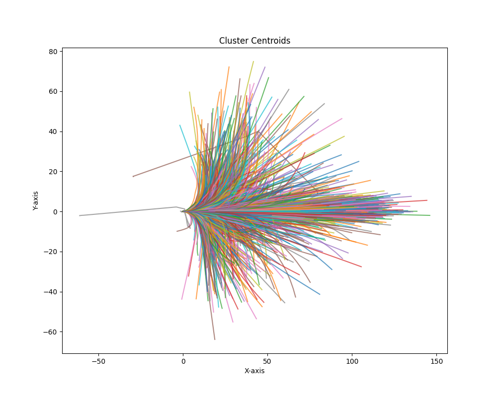

# VADv2

## Env setup

## Train & Test

### Data Preparation

The same as VAD data format. 

### Trajectory Clustering

Refer to `tools/traj_clustering.py`, which will cluster all trajectories to 4096 classes. The following component will be saved:

- Cluster centroids: saved in `npy` format
- MiniBatchKMeans sklearn model: saved in `pkl` format
- Visualization: as follows: 

## Open-loop Eval