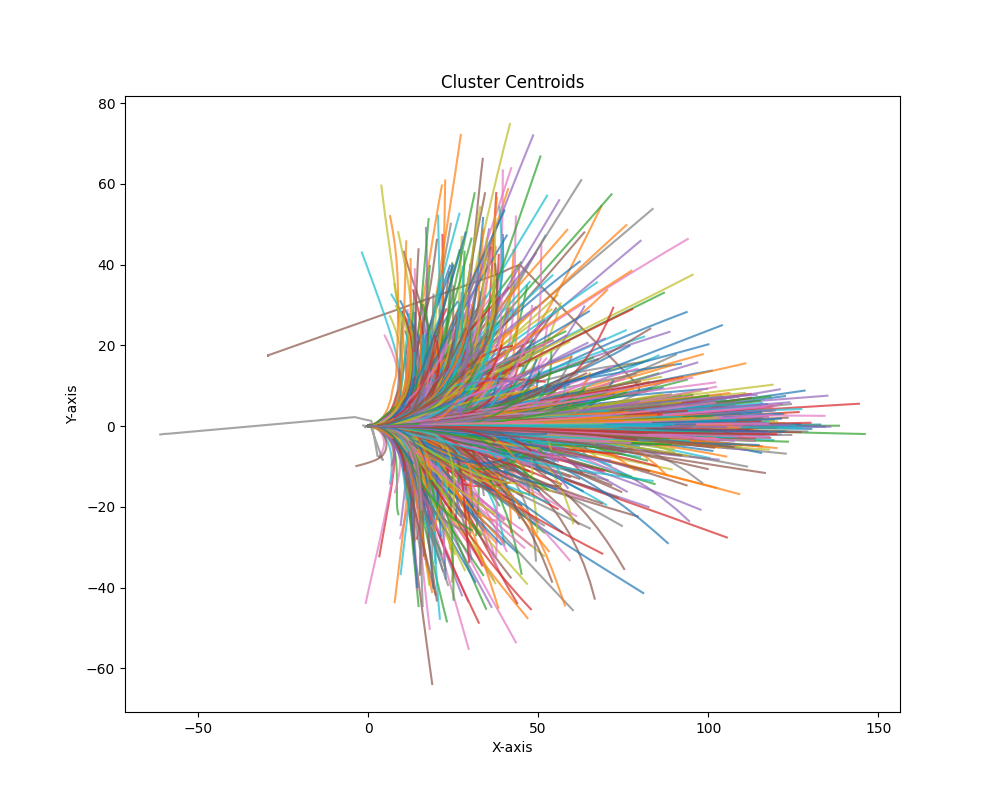

# Train & Test

## Data Preparation

The same as VAD data format. 

## Trajectory Clustering

Refer to `tools/traj_clustering.py`, which will cluster all trajectories to 4096 classes. The following component will be saved:

- Cluster centroids: saved in `npy` format
- MiniBatchKMeans sklearn model: saved in `pkl` format
- Visualization as follows: 

<p align="center">

</p>

## Train script

Assume run on 2-GPUs machine. RTX4090 or higher is recommended.

```bash
torchrun --nproc_per_node=2 \
    --master_port=28510 \
    adzoo/vad/train.py \
    adzoo/vad/configs/VAD/VADv2_voca4096_config.py \
    --launcher=pytorch \
    --deterministic
```

### Notes For Config File

Here we use [`VADv2_voca4096_config.py`](adzoo/vad/configs/VAD/VADv2_voca4096_config.py) as example to show the most frequently-used config

- `num_cams`: camera config, 8 for nuplan and 6 for nuscenes.
- `class_names`: detection classes, here we combine the objects in both nusc and nuplan dataset.
- `col_class`: objects that involved in collision penalty loss.
- `map_classes`: layers in maps (`.JSON`). For example `['divider', 'ped_crossing', 'boundary']` for nuplan; `['lane_divider', 'road_edge', 'crosswalk', 'centerline']` for nuscenes.
- `plan_fut_mode`: number of clusters for VADv2.
- `plan_anchors_path`: path to store clusters. Note: Different numpy version will cause issue loading/saving the `.npy` file. The example use `numpy==1.24.1` for [`cluster_centers_ori`](data/traj_clusters/4096/cluster_centers_ori.npy).
-`data_root`: root path for dataset.
-`ann_file_train/ann_file_test`: path to annotation files, usually in `.pkl` format. Essentially is a list of dict where each dict is meta infos of single frame.
-`ann_file_map`: check Tools section in `README.md` for [Convert Nuplan Map to Json Tools](tools/convert_gt_map_json.py).
- `load_from` and `resume_from`: if to load pre-trained models. See documents for `mmcv`.


## Test script

```bash
torchrun --nproc_per_node=1 --master_port=28512 \
    ./adzoo/vad/test.py \
    ./adzoo/vad/configs/VAD/VADv2_voca4096_config.py \
    path-2-your-model \
    --launcher=pytorch \
    --eval=bbox
```